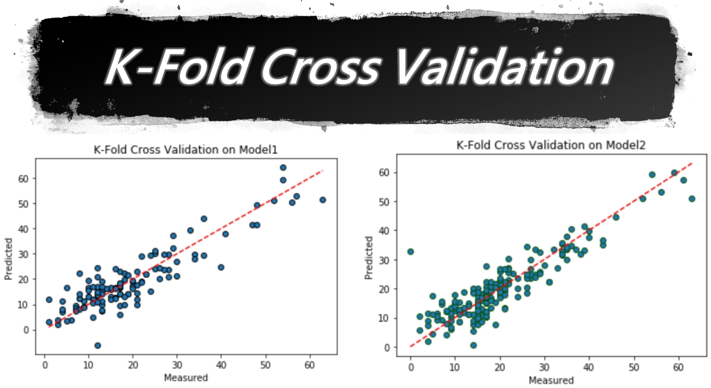
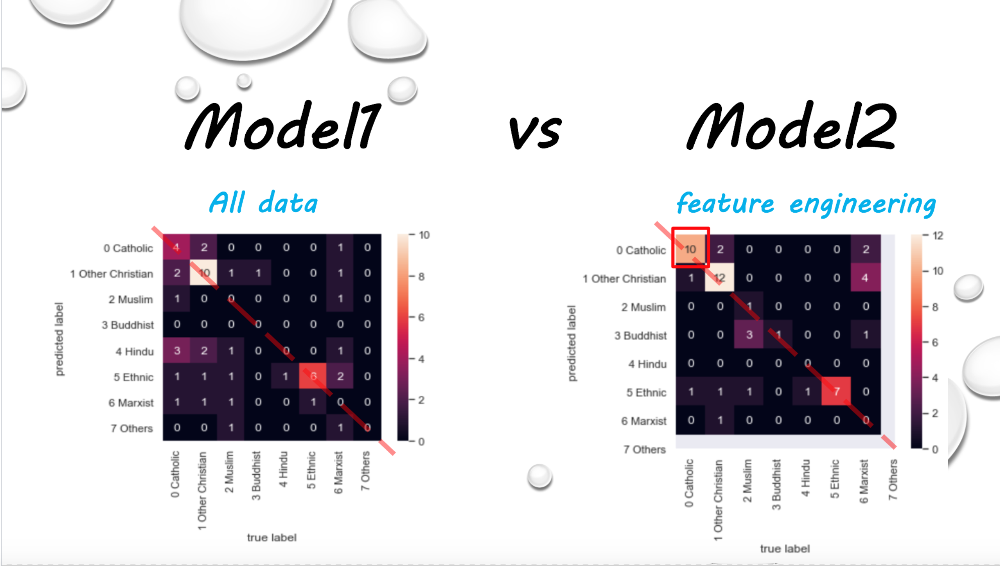
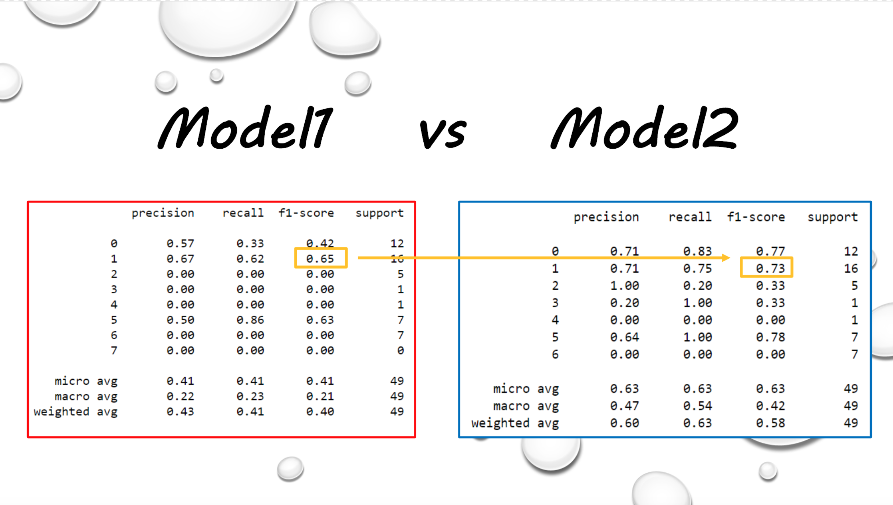

MMclass
=====
此專案是多媒體導論的課堂專案，分為兩個部分：[期中專案（pm2.5小幫手）](https://github.com/alanhc/MMclass/tree/master/midterm_project)及[期末專案（國旗與宗教之研究）](https://github.com/alanhc/MMclass/tree/master/final_project)，利用scikit-learn來實作各種機器學習的基本步驟及比較演算法之間的差異。

## [期中專案（pm2.5小幫手）](https://github.com/alanhc/MMclass/tree/master/midterm_project)
研讀演算法並實作（Linear Regression），使用政府開放資料及利用Pandas、matplotlib、scikit-learn，從資料的前處理、訓練模型及預測未來的pm2.5數據，以提供使用者未來的天氣預測。
結合 Smart Potting System (科技部大專生計畫) 提供更即時的天氣預報服務。
[[slide]](https://github.com/alanhc/MMclass/tree/master/midterm_project/slide)
[[paper]](https://github.com/alanhc/MMclass/blob/master/midterm_project/%E6%9C%9F%E4%B8%AD%E5%B0%88%E6%A1%88%E5%A0%B1%E5%91%8A-%E7%A9%BA%E6%B1%99%E5%B0%8F%E5%B9%AB%E6%89%8B.pdf)
[[data]](https://github.com/alanhc/MMclass/tree/master/midterm_project/data)
[[code]](https://github.com/alanhc/MMclass/tree/master/midterm_project/code)

## [期末專案（國旗與宗教之研究）](https://github.com/alanhc/MMclass/tree/master/final_project)
研讀演算法並實作（SVM、Naive Bayes classifier），使用UCI資料集及利用Pandas、matplotlib、scikit-learn，從資料的前處理、訓練模型探討特徵篩選對於及不同演算法及訓練出的模型對於結果的影響。
[[data]](https://github.com/alanhc/MMclass/blob/master/final_project/flag.csv)
[[paper]](https://github.com/alanhc/MMclass/blob/master/final_project/%E6%9C%9F%E6%9C%AB%E5%B0%88%E6%A1%88%E5%A0%B1%E5%91%8A.pdf)
[[code]](https://github.com/alanhc/MMclass/blob/master/final_project/0612demoCode.ipynb)

